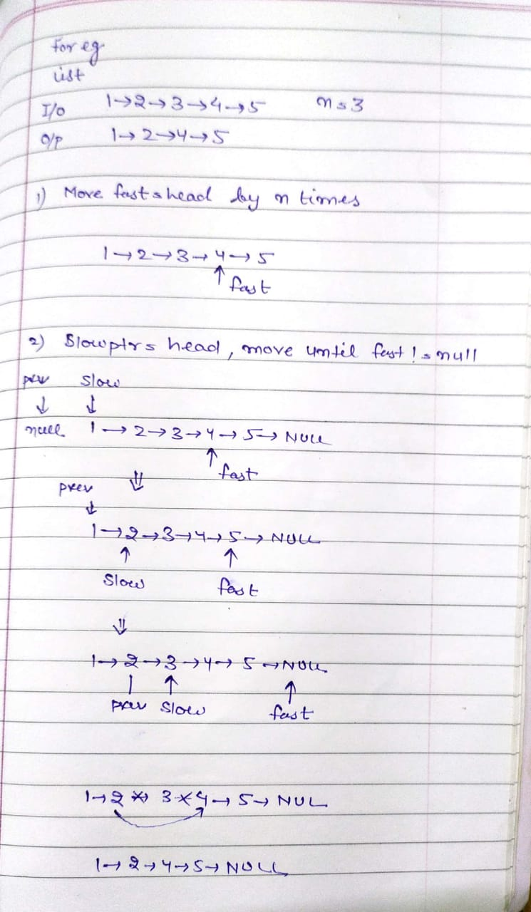

# Remove Nth Node from the End of Linked List 🔗

Pseudocode:-

- Take 3 pointers ➡️ prev, slow and fast and initialized as follows

```java    
    ListNode fastPtr = head;
    ListNode slowPtr = head;
    ListNode prevSlowPtr = null;
```

- Move the fast point by k steps.

```java
    // Move the fast Pointer by K positions
    while(k != 0) {
        fastPtr = fastPtr.next;
        k--;
    }
```

- Now move the slow ptr and fast ptr until fast becomes null. 

```java
    while(fastPtr != null) {
        prevSlowPtr = slowPtr;
        slowPtr = slowPtr.next;
        fastPtr = fastPtr.next;
    }
```

- Now remove the node at which prev pointer points

- caveat ⚠️ handle case when node to be deleted is the **first node**.


<br>
<br>
<br>
<br>

<br>
<div>

</div>
<br>
<br>


